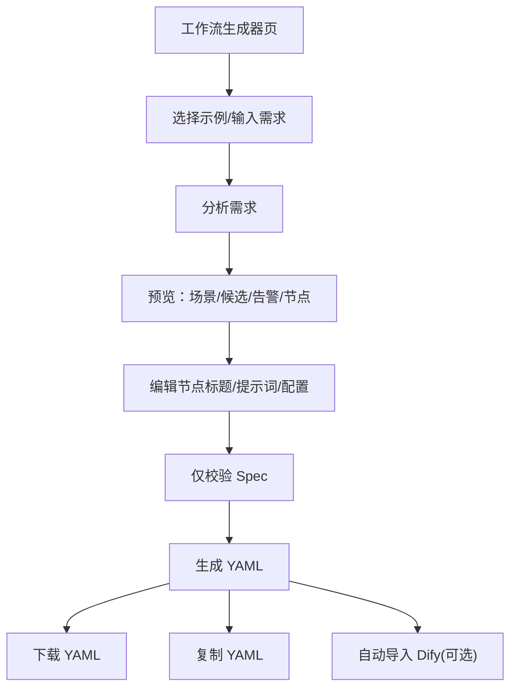

## 1. Product Overview
Auto-Agent 工作流生成器是一个单页工具：输入需求→AI 规划→可编辑节点→校验→生成并下载/复制 YAML。
本次改版目标：风格简洁高级、可读性强、功能分区清晰、强指引（让第一次使用也能顺畅完成“分析→编辑→生成”）。

## 2. Core Features

### 2.1 User Roles
本产品为本地/内网使用工具，不区分用户角色。

### 2.2 Feature Module
改版需求由以下页面构成：
1. **工作流生成器页**：任务引导（步骤/状态）、需求输入与示例模板、补充配置、工作流预览与编辑、校验与告警、生成结果与 YAML 预览。

### 2.3 Page Details
| Page Name | Module Name | Feature description |
|---|---|---|
| 工作流生成器页 | 顶部标题区 | 展示产品名称/版本副标题；提供“当前状态”（未分析/分析中/可生成/已生成）提示。 |
| 工作流生成器页 | 新手引导与空状态 | 在首次进入/未分析时展示可执行清单：①选择示例或输入需求②分析需求③按需编辑④校验⑤生成与下载；各区块空状态给出下一步指引。 |
| 工作流生成器页 | 需求输入区 | 输入工作流需求；支持快速填入示例（translate/summary/complex）与“加载复杂模板”。 |
| 工作流生成器页 | 分析需求 | 触发 /analyze；在聊天区追加用户输入与系统 followup 文本；展示分析结果摘要（规划模式/trace_id/修复轮次）。 |
| 工作流生成器页 | 补充配置区 | 编辑应用名称、应用描述、补充问题回答；设置能力裁剪（budget_level）与执行节点上限（max_exec_nodes）；设置“生成后自动导入 Dify”。 |
| 工作流生成器页 | 工作流预览总览 | 展示当前场景（scene_label）；展示候选评分列表（candidates_brief + 选中态）；展示校验/修复告警列表（validation_warnings）。 |
| 工作流生成器页 | 节点编辑器 | 以可折叠列表编辑 steps：标题（title）、提示词（prompt）、配置（config JSON）；编辑即写回当前 spec。 |
| 工作流生成器页 | Spec 校验 | 触发 /validate_spec；将 errors/warnings 汇总到告警区；在结果区显示“通过/未通过”。 |
| 工作流生成器页 | 生成与导出 | 触发 /generate；展示结果 message/filename；提供下载链接、复制 YAML；展示 Dify 导入状态（成功/失败不影响下载）。 |
| 工作流生成器页 | YAML 预览 | 预览生成后的 yaml_content；支持横向滚动与换行阅读。 |
| 工作流生成器页 | 健康检查提示 | 进入页面调用 /health；无可用模型时禁用“分析/生成”，展示配置指引与 provider 状态。 |

## 3. Core Process
你进入页面后：先选择示例或输入需求 → 点击“分析需求”获得场景、候选评分、节点列表与告警 → 你在“节点流程”里按需改标题/提示词/配置 → 可点击“仅校验 Spec”确认告警收敛 → 点击“生成 YAML”得到可下载文件与 YAML 预览 → 需要时开启“自动导入 Dify”，导入失败也不影响下载与复制。

