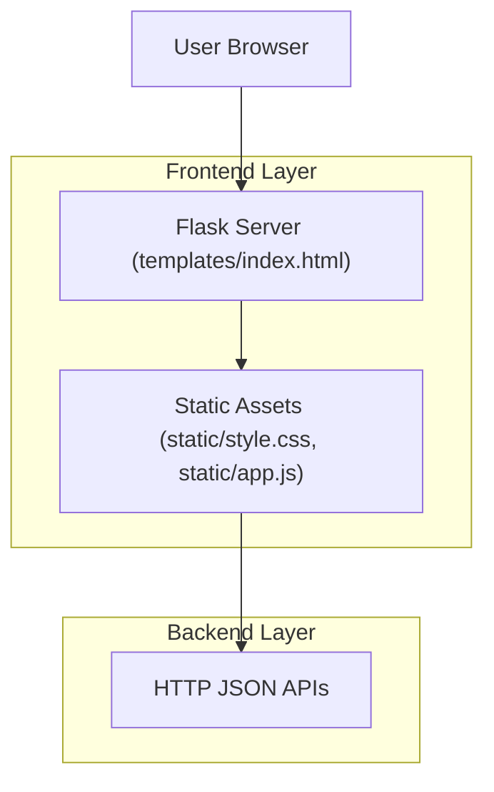

## 1.Architecture design


## 2.Technology Description
- Frontend: Server-rendered HTML + Vanilla JS（DOM 操作）+ CSS（Design Tokens + Flex 布局）
- Backend: Python + Flask（提供页面与 JSON API：/health、/analyze、/generate、/validate_spec、/template/*、/artifact/*）
- Database: None

## 3.Route definitions
| Route | Purpose |
|---|---|
| / | 主界面（工作流生成器单页） |
| /artifact/:id | 访问生成产物（YAML） |

## 4.API definitions (If it includes backend services)
### 4.1 Core API
健康检查
```
GET /health
```
Response（示意）
```ts
type HealthResponse = {
  model_ready: boolean;
  broken_proxy_detected?: boolean;
  provider_status?: Record<string, { ready: boolean; model?: string }>;
}
```

需求分析
```
POST /analyze
```
Request
```ts
type AnalyzeRequest = { user_input: string }
```
Response（示意）
```ts
type AnalyzeResponse = {
  scene_key: string;
  scene_label: string;
  workflow_spec: { workflow_name?: string; description?: string; steps: any[] };
  requirement?: any;
  candidates_brief?: Array<{ id: string; score: number; non_llm_node_ratio?: number }>;
  selected_candidate_id?: string;
  validation_warnings?: string[];
  planning_mode?: string;
  repair_rounds?: number;
  trace_id?: string;
  app_name_suggestion?: string;
  description_suggestion?: string;
  followup_text?: string;
  artifact_id?: string;
}
```

生成 YAML
```
POST /generate
```
Request（示意）
```ts
type GenerateRequest = {
  scene_key: string;
  scene_label: string;
  app_name?: string;
  description?: string;
  answers?: string[];
  workflow_spec: any;
  requirement?: any;
  strict_validation: boolean;
  budget_level: 'low' | 'balanced' | 'high';
  max_exec_nodes: number | null;
  import_mode: 'download_only' | 'download_and_import';
  auto_import_to_dify: boolean;
}
```
Response（示意）
```ts
type GenerateResponse = {
  message: string;
  filename: string;
  yaml_content: string;
  download_url: string;
  workflow_spec?: any;
  dify_import_status?: 'success' | 'failed' | 'not_requested';
  dify_import?: { job_id?: string };
}
```

仅校验 Spec
```
POST /validate_spec
```
Response（示意）
```ts
type ValidateSpecResponse = { ok: boolean; errors?: string[]; warnings?: string[] }
```

## 6.Data model(if applicable)
无（当前无持久化数据模型；产物以文件形式提供下载）。

### UI 改版落地的技术要点（与现有代码兼容）
- 建立更系统的 Design Tokens：颜色/字号/间距/圆角/阴影/边框/交互态（hover/focus/disabled），统一在 :root 管理。
- 统一组件规范：Card、Button、Input、Select、Textarea、Tag、Alert、Stepper（均可用原生 HTML + CSS 类实现）。
- 强化状态机渲染：以“未分析/分析中/已分析可编辑/校验失败/生成中/已生成”驱动按钮可用性与区块提示文案。
- 可读性优化：YAML/JSON 预览区使用等宽字体、行高、最大宽度与折叠/展开；长列表（节点/告警）支持分组与滚动容器。
- 可访问性：为表单控件补齐 label/aria；明显的 focus ring；对比度达标；错误提示就近呈现。
